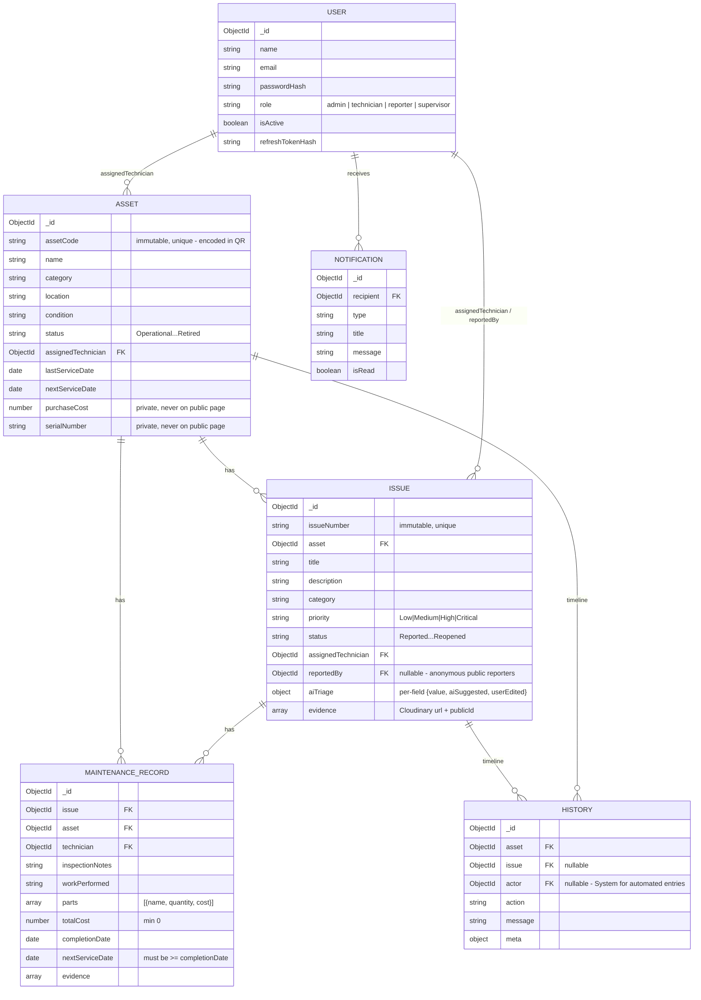

# MaintainIQ — Data Model

MongoDB / Mongoose. Six collections, all defined under `server/src/models/`.

## Key design points

- **`Asset.assetCode`** is generated once at creation and marked `immutable` in the schema — it's what the QR
  encodes, so it can never drift from the printed/generated QR even if the asset is renamed or moved.
- **`History`** has no update/delete route anywhere in the API — every state-changing service call
  (`assetService`, `issueService`, `maintenanceService`) writes its own entry as the last step of the same
  function that made the change. See `server/src/services/historyService.js`.
- **`Issue.aiTriage`** stores each AI-touched field as `{ value, aiSuggested, userEdited }` rather than a flat
  string, so the UI (and any grader) can see exactly which fields came from Gemini and whether the human
  reporter/technician changed them before saving.
- Private fields (`Asset.purchaseCost`, `Asset.serialNumber`, any maintenance cost/notes) are excluded from the
  public asset page via a dedicated Mongoose `.select()` projection (`Asset.PUBLIC_PROJECTION`), not by filtering
  in the controller — see `ARCHITECTURE.md` §3.5.
